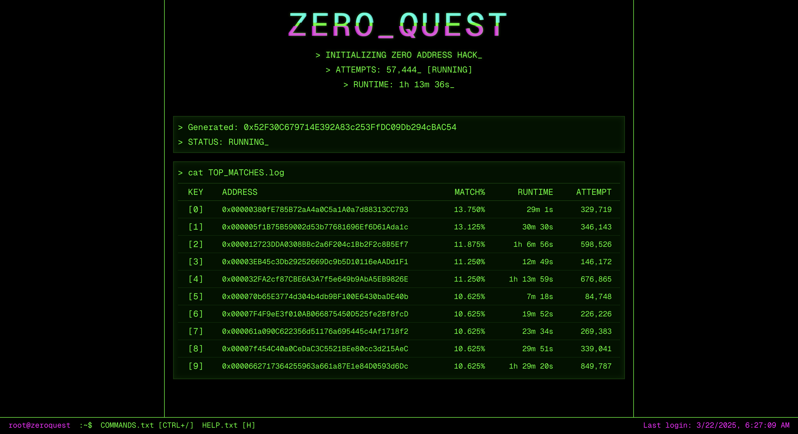
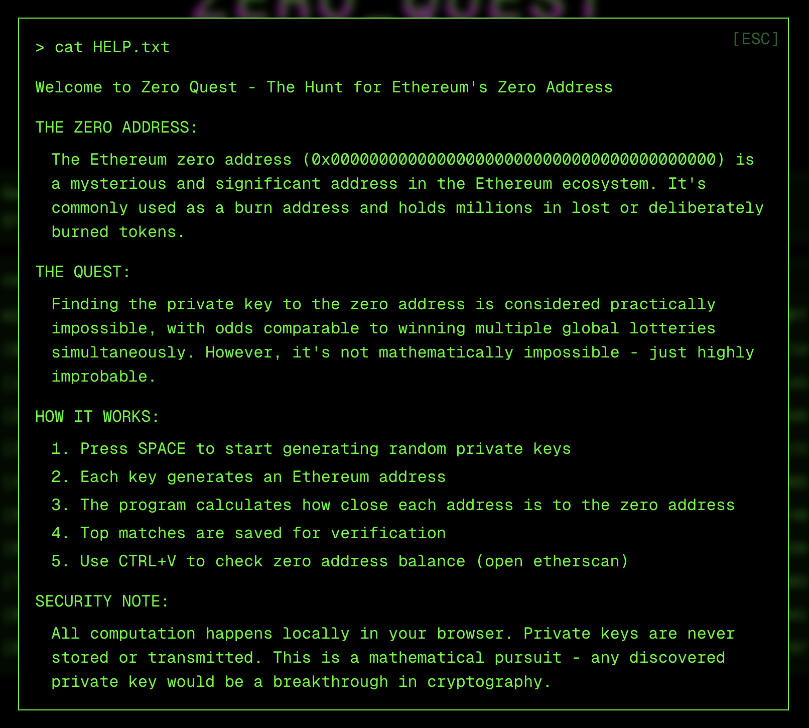
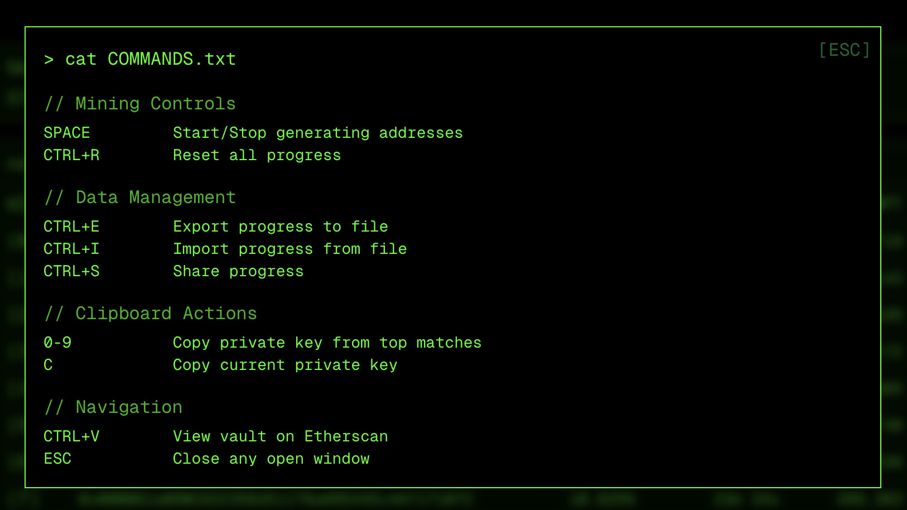
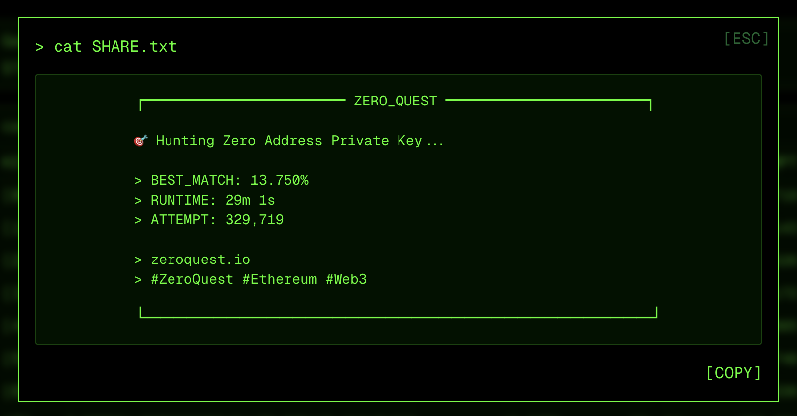

<div align="center" style="margin-bottom: 20px;">

</div>

# Zero Quest

Welcome to **Zero Quest**—where the brave dive into the wild world of Ethereum to crack the zero address. Think you can find the private key? It's a legendary challenge, and you're about to take it on.

🔗 **Check the Current Balance**: 💰 See what's locked behind the zero address [here](https://etherscan.io/address/0x0000000000000000000000000000000000000000#multichain-portfolio).

## Getting Started

Ready to roll? Here's how:

1. **Install the Goods**: Get your dependencies sorted with:

   ```bash
   yarn install
   ```

2. **Fire It Up**: Start the server and get things moving:

   ```bash
   yarn run dev
   ```

3. **Dive In**: Hit up [http://localhost:3000](http://localhost:3000) and start your quest.

## Why Zero Quest?

- **Epic Challenge**: Tackle the zero address and make history.
- **Slick UI**: Navigate with ease and style.
- **Join the Crew**: Be part of a community of crypto adventurers.

## Help Section

Need a hand? Check out the help section to get tips and tricks on navigating Zero Quest. Press `H` to open `HELP.txt`.

<div align="center" style="margin-top: 20px;">

</div>

## Commands Overview

Master the game with these commands. Get familiar with the controls and take your quest to the next level. Press `CTRL+/` to open `COMMANDS.txt`.

<div align="center" style="margin-top: 20px;">

</div>

## Share Your Glory

Found a killer match? Don't keep it to yourself! Flex your achievements and let the world know you're a true crypto explorer. Use the built-in share feature to brag about your progress and inspire others to join the quest.

<div align="center" style="margin-top: 20px;">

</div>

Jump into Zero Quest and see if you've got what it takes. Whether you're a crypto pro or just curious, this is your shot at glory.

---

Start your Zero Quest today. Let's see what you're made of!
